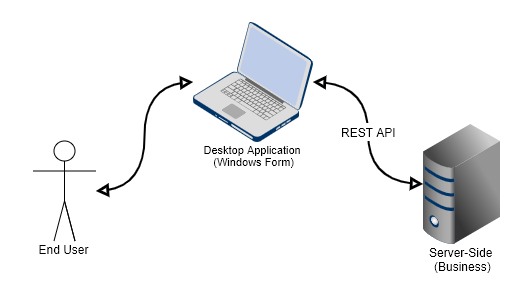
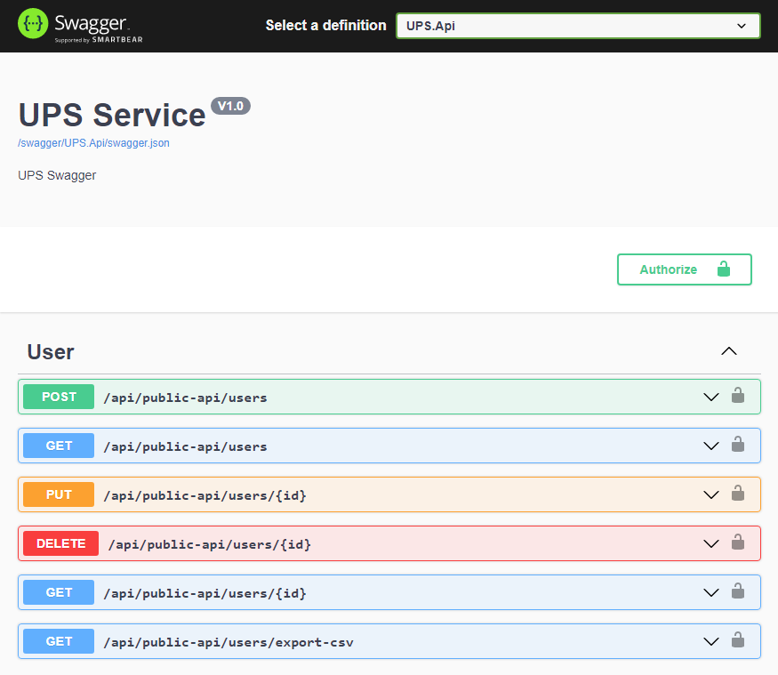
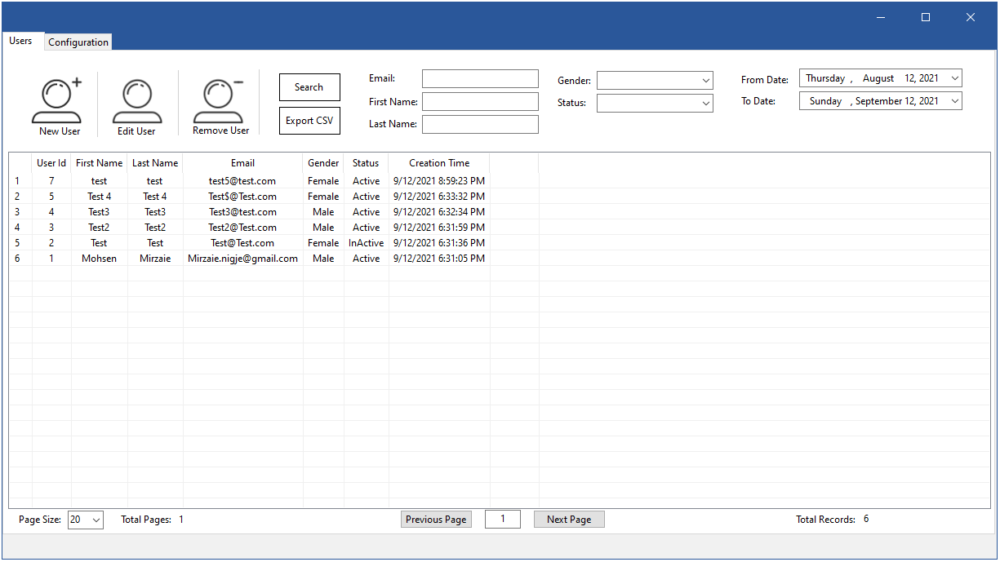
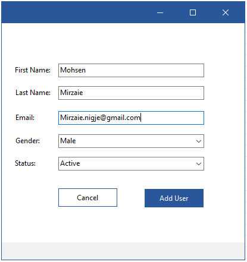
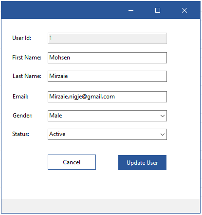

# Introduction

This is a Client/Server sample app based on ASP.NET Core and .NET 5 to manage users (based on the document requirements). On the server-side,  ASP.NET Core has been used, and on the client-side, Windows Form. The focus was on requirements such as high-performance, scalability, reliability, extensibility. The following is technologies that have been used. I'm going to regularly update the document in the next commits.

In the first step, run the `USP.Api` and make sure that the API URL is the same as the `BaseUrl` of the `app.config` in the `UPS.WindowsForm` , and finally run the `UPS.WindowsForm` project (ex: https://localhost:xxxx).

### Technologies:

- .NET 5
- ASP.NET Core
- EF Core
- SQL Server
- Autofac
- Swagger
- Automapper
- xUnit (Moq)
- Docker
- Windows Form (.NET 5)

### Todo:

- Write test in controller level (Integration).
- Indicate loading logo/text during fetching data in forms.
- Add docker-compose.yml
- Add Serilog, Elasticsearch, Kibana, Fluentd, Nginx.


<p align="center">
  
</p>

## Server-Side (Web API)

User's businesses are handled on the server-side and windows form application is an interface for it. On the server-side, there are 6 REST API endpoints to manage users that means easily can migrate to other interface technologies such as WPF, React.js, Blazor, Electron.

```
- POST		/api/public-api/users 				This endpoint uses to add new user.
- PUT		/api/public-api/users/{id} 			This endpoint uses to update a user.
- DELETE	/api/public-api/users/{id} 			This endpoint uses to remove a user.
- Get		/api/public-api/users/{id} 			This endpoint uses to get a user.
- Get		/api/public-api/users	 			This endpoint uses to get list user.
- Get		/api/public-api/users/export-csv 	This endpoint uses to get list user as a csv file.
```


For authorization, all requests need an API token (ACCESS-TOKEN) that is set on the header. I set `afe45081-09a9-4e76-ae50-b4b480ecfbe4` as ACCESS-TOKEN (check config files).


```powershell
curl -i -H "Accept:application/json" -H "Content-Type:application/json" -H "Authorization: Bearer ACCESS-TOKEN" -XGET "{base-url}/api/public-api/users"
```


<p align="center">
  
</p>


### Migrations

By default, the project uses SQL Express (MSSQLLocalDB) and runs migrations automatically (check Startup.Configure()). To add new models use the following code in command line.

```powershell
dotnet ef migrations add InitializeModels -s UPS.Api -p UPS.DB
```

if you got a error like the following message, update your EF tools by `dotnet tool update --global dotnet-ef`

> The Entity Framework tools version 'x.x.x' is older than that of the runtime 'y.y.y'. Update the tools for the latest features and bug fixes.
> The name 'InitialModels' is used by an existing migration.

```powershell
dotnet tool update --global dotnet-ef
```

To update database use the following code.

```powershell
dotnet ef database update -s UPS.Api -p UPS.DB
```


### Exceptions

When an exception occurs in the system the action result will be such as the following object and response HttpStatusCode will be 4xx or 5xx. HttopStatusCode in the range of 4xx shows the exception is because of user behavior (client-side) and 5xx shows it has occurred because of system defects (server-side).

```json
{
  "__unauthorizedRequest": true,
  "__wrapped": true,
  "__traceId": "",
  "error": {
    "errorCode": "USER_NOT_FOUND",
    "message": "User not found.",
    "details": "",
    "source": ""
  }
}
```

 The above response had HttpStatusCode 404 that shows the not found exception has occured. Depend on the application is running on production or other environments, the `message`, `details`, and `source` can have more details about exceptions. 

- **__unauthorizedReques**t: shows the request is authorized or not. In the above example, the request is not authorized.
- **__wrapped**: shows the result is wrapped or not. Now, by default, all exceptions are wrapped.
- **__traceId**: TraceId will use to track a request over other systems and services. It is not implemented.
- **error.errorCode**: ErrorCode shows the exception reason. When a developer throws a `UPSException`, he/she will fill this field.
- **error.Message**: Message shows the exception reason.  
- **error.Details**: Details shows details of exceptions such as stack trace and inner exception details. It is always empty in production environment.
- **error.Source**: The source shows the service that has raised the exception. If you use microservice architecture, It would show the name of the service and its version. The following config is needed in `appsetting. json` (It is always empty in production).


```json
{
  "ServiceInfo": {
    "Name": "Service Name",
    "Description": "Service Description",
    "Version": "1.0"
  }
}
```


This project has its Exception that is derived from Exception. Also, there are other exceptions that are derived from `UPSException`. Check `GlobalExceptionFilter.cs` class for more details about exceptions.

```c#
public class UPSException : Exception 

{
    /// <summary>
    /// Error code that indicates a summary of error by using some words or numbers.
    /// </summary>
	public string ErrorCode { get; protected set; }
    
    /// <summary>
    /// Technical-details are not allowed to be shown to the user.
    /// Just log them or use them internally by software-technicians.
    /// </summary>
    public string TechnicalMessage { get; protected set; }
}
```


- **UPSException**: This exception use generally and its HttpStatusCode will be 500.

- **UPSExceptionNotFound**: This exception use to show NotFoundException and HttpStatusCode will be 404.

- **UPSExceptionInvalidParameter**: This exception use to show InvalidParameter and HttpStatusCode will be 422.

- **UPSBusinessException**: This exception use to show BusinessException and HttpStatusCode will be 400 (for exceptions that should be thrown because of a business defect).

- **UPSExceptionAuthenticationFailed**: This exception use to show  unauthorized request and HttpStatusCode will be 403.

- **Exception**:  This exception use generally and its HttpStatusCode will be 500.

  

## Client-Side (Windows Form)

User's businesses are handled on the server-side and windows form application is an interface for it. There is a base form (TemplateForm) that others derive it. The following is the list of project forms:

- **LoadForm**: It is loaded during the load of MainForm (as a loading page).
- **MainForm**: It is the main form.
- **UserForm**: It is used to add and update a users.
- **MessageForm**: It is used to show errors and normal messages to users.
- **TemplateForm**: It is a base form for others that derive it and includes base designs.


**MainForm**
<p align="center">
  
</p>


**UserForm**
<p align="center">
  
   
</p>


